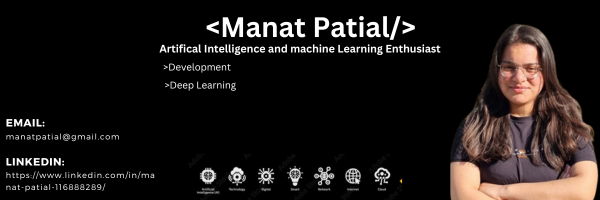

<h1 align="center">Hi 👋, I'm Manat Patial</h1>
<h3 align='center'>
  Web Development | Machine Learning
</h3>

  

 

 
Frontend Web Developer | Artifical Intelligence and machine Learning Enthusiast
 

____

I'm a passionate frontend web developer with a keen interest in artificial intelligence and machine learning. I'm currently interning at the Indian Institute of Technology Mandi as a research intern, focusing on applying machine learning techniques for object detection in autonomous vehicles.Let's connect and explore how we can leverage machine learning to unlock new possibilities for your organization.

____
- 🤝 I'm open to collaborating on innovative projects that integrate machine learning with real-world applications.

- 🔭 I’m currently working on  implementing and optimizing machine learning algorithms for object detection at IIT Mandi.

- 🌱 I’m currently learning advanced techniques in deep learning and exploring their applications in computer vision at IIT Mandi.

- 👨‍💻 All of my projects are available at these [repositories](https://github.com/Manatpatial?tab=repositories)
  
- 📫 How to reach me: For any inquiries or collaboration opportunities, please feel free to contact me via email at manatpatial66@gmail.com. I look forward to connecting with you.

____
## 🔗 Let's Connect:

____
## ⚙ Languages and Tools:

